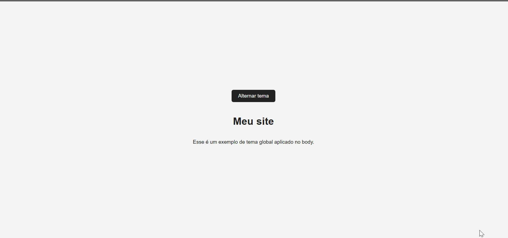

# 🌗 Theme Toggle com React

## 📷 Demonstração



➡️ [Veja online](https://alanpedrod.github.io/tema-light-e-dark/)

Implementação de alternância entre tema claro e escuro utilizando React, com aplicação global de estilo no `<body>`.

O objetivo foi praticar gerenciamento de estado, controle de efeitos colaterais e organização escalável de classes CSS.

---

## 🚀 Visão Geral

A aplicação permite alternar entre **modo claro** e **modo escuro**, aplicando a classe `dark` diretamente no `<body>`, permitindo que todo o layout herde o tema automaticamente.

A atualização de estado é feita utilizando a forma funcional do React:

```js
setDark(prev => !prev);
```

Essa abordagem garante segurança contra possíveis atualizações assíncronas de estado.

---

## 🧠 Decisões Técnicas

### ✔ Aplicação de tema global

Em vez de aplicar estilos inline ou apenas no componente, o tema é aplicado no `<body>` através de `useEffect`:

```js
useEffect(() => {
  if (dark) {
    document.body.classList.add("dark");
  } else {
    document.body.classList.remove("dark");
  }
}, [dark]);
```

Isso permite que qualquer componente da aplicação responda automaticamente ao tema, sem necessidade de passar props manualmente.

---

### ✔ Escalabilidade na aplicação de classes

A estrutura foi pensada para permitir múltiplas classes dinâmicas conforme a aplicação cresce.

Exemplo:

```jsx
<div className={`container ${dark ? "dark" : ""} ${ativo ? "ativo" : ""}`}>
```

Essa abordagem possibilita:

* Ativar múltiplos estados visuais
* Controlar variações de layout
* Manter separação clara entre lógica e estilo
* Escalar a aplicação sem acoplamento excessivo

---

## 🛠 Tecnologias Utilizadas

* React
* JavaScript (ES6+)
* CSS3

---

## 📈 Conceitos Aplicados

* Gerenciamento de estado com `useState`
* Atualização funcional de estado
* Controle de efeitos colaterais com `useEffect`
* Manipulação controlada do DOM
* Separação entre lógica e apresentação
* Estrutura preparada para escalabilidade

---

## 🔮 Possíveis Evoluções

* Persistência do tema com `localStorage`
* Implementação com Context API para controle global
* Transições animadas entre temas
* Botão com ícone dinâmico (claro/escuro)

---

## 📷 Demonstração

(Adicionar GIF ou imagem do funcionamento)

---

## 📦 Como Executar

```bash
npm install
npm run dev
```

---

## 👨‍💻 Autor

Alan Dias
Projeto desenvolvido como parte da evolução em React e fundamentos de front-end.
